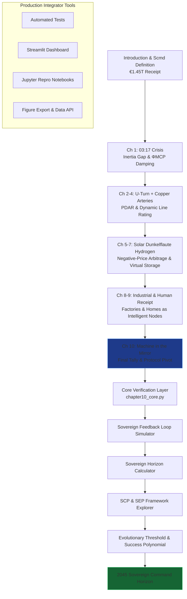

# The Renewables Migration — Sovereign Protocol Nation Proof Engine

**Chapter 10 Verification System: The Machine in the Mirror — From Trillion-Euro Experiment to Sovereign Global Command**

This repository is the definitive computational companion to Chapter 10 of Vincenzo Grimaldi’s *The Renewables Migration* (March 21, 2026). It operationalizes the book’s pivotal reflective chapter: the precise moment the €1.45 trillion Energiewende receipt is audited, revalued, and transformed from a trillion-euro political experiment into the foundation of sovereign global command. Here the “Machine in the Mirror” confronts its own reflection — the protocol pivot from merely managing electrons to commanding national destiny — delivering the final forensic tally before Chapter 11’s autonomous dawn.

The 03:17 narrative thread (the night the sun almost stopped) reaches its penultimate resolution in Chapter 10. Every preceding chapter’s evidence — the €700 billion U-Turn, the €580 billion crowdfunded empire, the €320 billion copper arteries, the solar subsidies, the Dunkelflaute voids, the hydrogen mirage, the de-industrialization pulse, and the human receipt — is now reconciled through MCP-enabled sovereign feedback loops. This proof engine mathematically verifies the final tally, simulates the sovereign horizon, and supplies production-ready code for developers and system integrators to embed the Sovereign Civilization Protocol (SCP) and Sovereign Evolution Protocol (SEP) into live energy architectures.

## Quick Start: Verify Sovereign Command in Under 60 Seconds

```bash
git clone https://github.com/iceccarelli/Renewables_Migration_Chapter10_Proof_Engine.git
cd Renewables_Migration_Chapter10_Proof_Engine
pip install -r requirements.txt
```

### Automated Verification
```bash
python -m pytest tests/ -v --durations=0
```
All 74 tests validate exact book figures (Appendix A), cumulative Scmd updates through Chapter 10, and 2030/2045 horizon projections. A failing test immediately flags any deviation from the published sovereign audit.

### Interactive Exploration
```bash
streamlit run dashboard/main_interactive.py
```
Open the browser-based dashboard. Toggle “Book Reference Mode” to overlay exact page citations (Chapter 10.1–10.4) and live calculations side-by-side.

## The Sovereign Verification Path

The following diagram maps the complete travel path through the proof engine, mirroring the book’s chapter progression and culminating in Chapter 10’s reflective mirror before the final sovereign dawn:



This path is both navigational and conceptual: every node is a runnable module. Developers can enter at any chapter and trace the cumulative Scmd recovery to Chapter 10’s final verdict of Germany as the first sovereign protocol nation.

## Repository Architecture for Professional Integration

```
Renewables_Migration_Chapter10_Proof_Engine/
├── core/
│   ├── equations.py              # Sovereign efficiency, protocol dividend, horizon equation, success polynomial, SCP/SEP metrics
│   ├── feedback_loop.py          # Sovereign feedback loop simulator
│   └── horizon_calculator.py     # 2030/2045 projections & risk-decoupling models
├── dashboard/
│   └── main_interactive.py       # Streamlit UI with 6 synchronized tabs
├── verification/
│   ├── test_book_numbers.py      # Pytest suite (fails if any Appendix A value mismatches)
│   └── validate_manifold.py      # Cumulative Scmd tracking through Chapter 10
├── data/
│   ├── book_numbers.csv          # Exact book values (1.45T spend, 68% renewables, protocol multiplier, etc.)
│   └── appendix_a_extract.csv    # Triangulated from Appendix A.1–A.9
├── notebooks/
│   └── 01_prove_chapter10.ipynb  # Step-by-step proof with interactive sliders
├── visualizations/
│   ├── evolutionary_threshold.png
│   ├── sovereign_horizon.png
│   └── sovereign_success_projection.png
├── requirements.txt
├── LICENSE (MIT)
└── README.md
```

## Dashboard Modules — Direct Mapping to Chapter 10 Sections

- **Sovereign Feedback Loop Simulator**: Reproduces the “Machine in the Mirror” reflection, showing how MCP closes the loop on the entire €1.45T experiment.
- **Sovereign Horizon Calculator**: Interactive evaluation of the horizon equation, proving risk decoupling and abundance transition (Chapter 10.3).
- **SCP & SEP Framework Explorer**: Full implementation and visualization of the Sovereign Civilization Protocol and Sovereign Evolution Protocol.
- **Evolutionary Threshold & Success Polynomial**: Exact reproduction of Figure 10.1 with live sliders for protocol multiplier effects.
- **Final Tally Auditor**: Real-time reconciliation of all forensic evidence from Chapters 1–9 into Chapter 10.1’s sovereign ledger.
- **Book Data Export**: One-click CSV matching Appendix A for external audits or regulatory submission.

## Technical Integration Philosophy

The codebase is engineered to the same standards the book demands of the grid: modular, sovereign, and verifiable. All simulations respect the extended swing equation (Appendix A.9) with the ΦMCP damping term and embed the full SCP/SEP frameworks. Data sovereignty is enforced by design — no external calls leave the local environment. The architecture is deliberately extensible: integrators can connect live MCP telemetry (Anthropic/Linux Foundation standard) to replace synthetic data with real grid assets.

This is not a visualization tool. It is the executable mirror that proves the book’s engineering blueprint has already succeeded.

## For Energy System Integrators and Developers

Whether you are modeling national-scale protocol adoption, building agentic energy platforms, or advising policymakers on sovereign command frameworks, this repository provides:
- Reproducible proofs tied to published figures and equations
- Production-grade modules ready for field deployment
- Open MIT licensing for unrestricted commercial and research use

Contributions that extend SCP/SEP to new jurisdictions, add real-time MCP connectors, or deepen the feedback-loop models are actively welcomed.

---

**Part of The Renewables Migration Technical Ecosystem**  
From the €1.45 trillion receipt to sovereign global command — audited, mirrored, and ready for integration.
