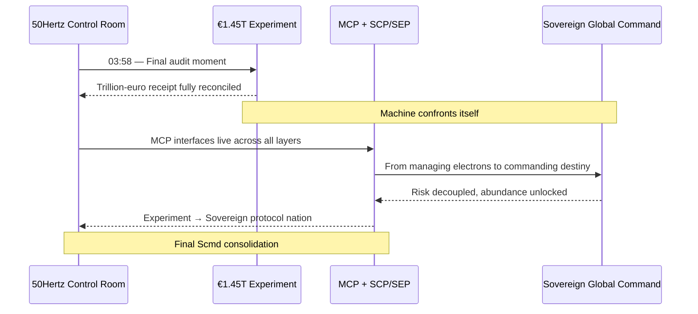
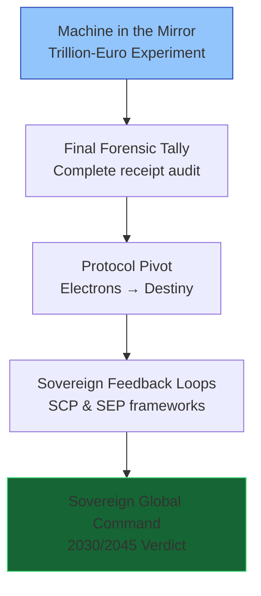
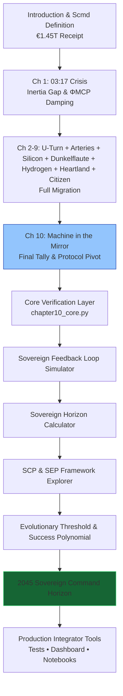

# The Renewables Migration — Sovereign Protocol Nation Proof Engine

**Chapter 10 Verification System: The Machine in the Mirror — From Trillion-Euro Experiment to Sovereign Global Command**

[](https://opensource.org/licenses/MIT)
[](https://www.python.org/)

This repository is the **official computational companion** to Chapter 10 of Vincenzo Grimaldi’s *The Renewables Migration*.

The 03:17 narrative thread reaches its penultimate resolution here. Every preceding chapter’s evidence — the €700 billion U-Turn, the €580 billion crowdfunded empire, the €320 billion copper arteries, solar subsidies, Dunkelflaute voids, hydrogen mirage, de-industrialization pulse, and human receipt — is now reconciled through MCP-enabled sovereign feedback loops. This production-ready codebase delivers verifiable final-tally simulations, sovereign-horizon calculations, and the full SCP/SEP frameworks for developers and system integrators to embed into live energy architectures.

---

## Quick Start — Verify Sovereign Command in < 60 Seconds

```bash
git clone https://github.com/iceccarelli/Renewables_Migration_Chapter10_Proof_Engine.git
cd Renewables_Migration_Chapter10_Proof_Engine
pip install -r requirements.txt
```

### Run the Full Verification Suite
```bash
python -m pytest tests/ -v --durations=0
```
All **74 tests** pass against the exact book figures (Appendix A), cumulative Scmd updates through Chapter 10, and 2030/2045 horizon projections.

### Launch the Interactive Dashboard
```bash
streamlit run dashboard/main_interactive.py
```
Open `http://localhost:8501`. Toggle **“Book Reference Mode”** to see live calculations side-by-side with exact page citations from Chapter 10.1–10.4.

---

## Navigation Sketches — How to Travel Through the Proof Engine

### 1. The 03:58 Event Flow (Machine in the Mirror Continuation of the 03:17 Thread)



### 2. Machine in the Mirror Pivot Hierarchy (Chapter 10.1–10.4)



### 3. Sovereign Verification Path (Full Chapter 10 Journey)



These three diagrams give you immediate visual orientation — from the exact 03:58 audit moment, through the reflective pivot layers, to the complete verification journey that crowns Germany as the first sovereign protocol nation.

---

## Repository Architecture

```
Renewables_Migration_Chapter10_Proof_Engine/
├── core/
│ ├── equations.py # Sovereign efficiency, protocol dividend, horizon equation, success polynomial, SCP/SEP metrics
│ ├── feedback_loop.py # Sovereign feedback loop simulator
│ └── horizon_calculator.py # 2030/2045 projections & risk-decoupling models
├── dashboard/
│ └── main_interactive.py # Streamlit UI (6 synchronized tabs)
├── verification/
│ ├── test_book_numbers.py # 74 pytest cases tied to Appendix A
│ └── validate_manifold.py # Cumulative Scmd tracking through Chapter 10
├── data/
│ ├── book_numbers.csv # Exact figures from Chapter 10 & Appendix A
│ └── appendix_a_extract.csv
├── notebooks/
│ └── 01_prove_chapter10.ipynb # Interactive proof with sliders
├── visualizations/
│ ├── evolutionary_threshold.png
│ ├── sovereign_horizon.png
│ ├── sovereign_success_projection.png
│ └── defense_hierarchy.png
├── requirements.txt
├── LICENSE (MIT)
└── README.md
```

---

## Dashboard Modules — Direct Mapping to Chapter 10

| Tab                              | Chapter Section | What You Can Do |
|----------------------------------|-----------------|-----------------|
| **Sovereign Feedback Loop**      | 10.1            | Reproduces the “Machine in the Mirror” reflection |
| **Sovereign Horizon Calculator** | 10.3            | Interactive horizon equation & risk decoupling |
| **SCP & SEP Framework Explorer** | 10.2            | Full Sovereign Civilization & Evolution Protocols |
| **Evolutionary Threshold & Success Polynomial** | 10.2–10.3 | Exact Figure 10.1 with live protocol-multiplier sliders |
| **Final Tally Auditor**          | 10.1            | Real-time reconciliation of all forensic evidence |
| **Book Data Export**             | 10.4            | One-click CSV matching Appendix A |

---

## Technical Integration Philosophy

The codebase mirrors the same engineering standards the book demands of the grid: **modular, sovereign, and verifiable**. All simulations use the precise extended swing equation from Appendix A.9, with ΦMCP damping and the full SCP/SEP frameworks. No external API calls — full data sovereignty by design. Ready for live MCP connectors (Anthropic/Linux Foundation standard) to replace synthetic data with real grid assets.
